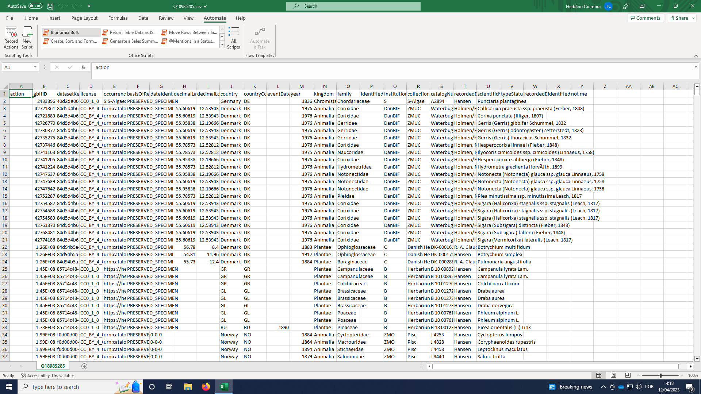

# bionomia-bulk-prepare
This Excel Automation script prepares files downloaded from Bionomia Bulk Attributions to quickly assign recorded/identified/recorded,identified to action

It adds filters, and sorts by institutionCode (as a person tends to have the same string value in an institution, making it easier to verify). It also changes the width of some columns to make visualisation easier (basisOfRecord, license, etc. to 0; recordeBy, identifiedBy to 150).
It adds three auxiliary columns at the beginning to check for matches on identifiedBy and recordedBy columns:
- A2 is to write the sting to find a match (part of the name of the person)
- Column B looks for that string on column recordedBy
- Column C looks for matches on identifiedBy
A formula on action column will write the values based on those matches (recorded/ identified / recorded,identified).

This is the english version, you might need to translate the functions to match your system language.

# Installation
1. In Excel on the web, for Windows, or for Mac, open an Excel workbook. Select Automate > New Script
2. Paste the code on the script editor
3. Save script with your preferred name (for example "Bionomia Bulk Prepare")

# How to use
After downloading the csv file for bulk attribution from Bionomia, open it with MS Excel. Select Automate > [script_name] > Run.
The script will modify the spreadseet.
Write on A2 the agentName string you want to match (part of the name of the agent). Press enter.
THe column D (action) will be filled in with the values according to matches (recorded/ identified/ recorded,identified).
You should then check each line, as you normally do, and correct/delete the values if it is the case.
Save the csv and submit it to Bionomia as you normally do.

# Screenshots

